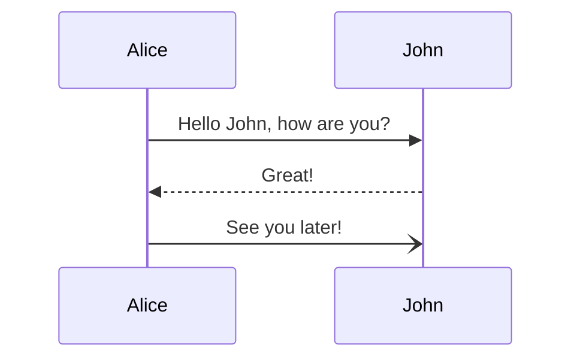
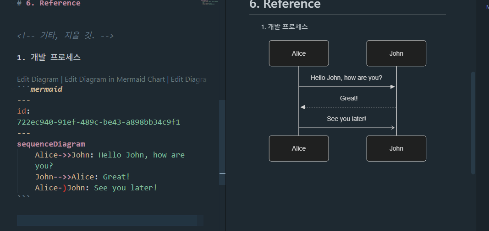

<!-- 

Project     : RPG MAP Maker
Prompting   : Claude
Coding      : Codex

-->

# 1. 개요 (Overview)

## 1-1. 프로젝트 추진 배경
## 1-2. 요구 사항 

# 2. 개발 목표

## 2-1. 개발 환경

## 2-2. 핵심 기능

## 2-3. 목표 (산출물 계획)

## 2-4. 기대 사항

# 3. 개발 개요 

## 3-1. 개발 범위 (모듈별 Category 구분)

## 3-2. 전체 S/W Layer 구조

예) 
Application Layer
 ├─ OAM
 ├─ KPI Monitor
 ├─ Alarm Manager

Middleware
 ├─ Message Queue
 ├─ DB Interface

Protocol Stack
 ├─ RRC
 ├─ PDCP
 ├─ RLC
 ├─ MAC

Platform
 ├─ Linux
 ├─ Driver
 └─ BSP

## 3-3. Interface 정의 (외부, 내부)

## 3-4. 적용 기술

# 4. 개발 절차 및 수행 체계

## 4-1. 전체 개발 Step 별 프로세스 (일정포함)

## 4-2. Step 별 주요 내용 

# 4. 진행 현황

# 5. 추가 해야할 내용

# 6. Reference

<!-- 기타, 지울 것. -->

1. 개발 프로세스

