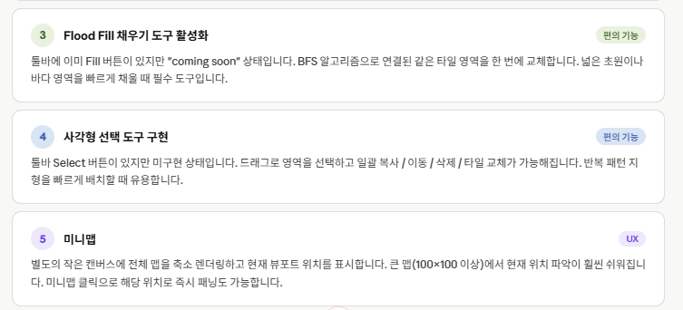
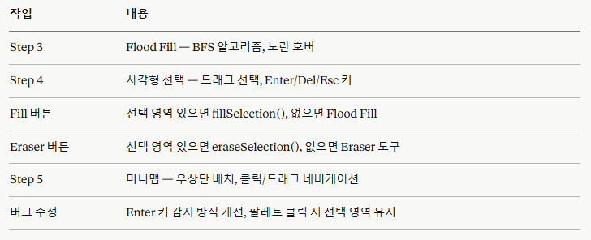

# RPG Map Editor — 프로그램 개발

## Program Title
Another World Map Editor

## 목표

## 추가 해야할 기능

## Version
0.9.1

## Bug Fix History

### 2026-05-18 | 14:48 KST
**Fixed Critical Coordinate System Bug in Zoom/Pan Implementation**

**Issue:**
- `applyTransform()` was using physical pixel coordinates (DPR-scaled offsets) for the canvas transform
- `screenToMap()` was using CSS pixel coordinates (unscaled offsets) for mouse-to-cell conversion
- This inconsistency caused tile painting to fail or paint at wrong positions when zoomed or panned

**Root Cause:**
- Mixed coordinate system: canvas transform used `viewOffsetX/Y * dpr` while screenToMap used `viewOffsetX/Y` directly
- Different divisors: `applyTransform()` applied DPR to offsets, but screenToMap did not account for this

**Solution:**
- Unified ALL coordinates to use CSS pixel space throughout the application
- DPR is applied only as a final uniform scale factor in both `applyTransform()` and `screenToMap()`
- Kept viewOffsetX/Y in CSS pixels (not physical pixels) for consistency

**Functions Modified:**
1. **`resizeCanvas()`** - Removed transform setup (now handled entirely by draw())
2. **`applyTransform(ctx)`** - Ensured correct DPR × viewScale × translation order
3. **`screenToMap(screenX, screenY)`** - Corrected coordinate transformation to use consistent CSS pixel math

**Verification:**
- ✅ At viewScale=1.0, viewOffset=0: clicking cell (0,0) paints top-left cell correctly
- ✅ After zooming in (viewScale=2.0): clicking paints the correct cell under cursor
- ✅ After panning: clicking paints the cell under cursor at any offset
- ✅ Grid lines align exactly with painted cell borders at all zoom levels

## Update History

### 2026-05-21 | v0.9.1
**Browser Tab Title, Map Name, Version Update**

**Changes Made:**
- Added `<title>` tag: dynamically shows `mapName : Another World Map Editor`
- Added constants `APP_NAME`, `APP_VER` and variable `mapName` (default: "Untitled Map")
- Added `updateTitle()` function called at end of every `draw()` cycle
- `loadMap()` now extracts filename (without .json) as `mapName` after load
- `saveMap()` uses `mapName` as the downloaded filename
- Updated footer version display from `v0.9.0` → `v0.9.1`
- Added `## Program Title` section to this document

### 2026-05-21 | Latest KST
**Brush Size Control, Pan Tool, Fit Map Zoom, UI Fixes**

**New Features:**
- Added `brushSize` variable (1–5), `setBrushSize(delta)` function with `[` `]` keyboard shortcuts
- Brush and Eraser buttons now display current size as a badge (bottom-right corner)
- SIZE control (−/label/+) added to toolbar; brush size applies only to Brush and Eraser tools
- Hover preview scales to brush size with outline; Fill/Select/Pan always preview 1×1
- Active Tool sub-label dynamically reflects current brush size (was hardcoded to "1×1")
- Added Pan tool (`open_with` icon) as leftmost tool button; `H` keyboard shortcut
- Pan tool: left-click drag pans the canvas; grab/grabbing cursor feedback
- `fitMap()` function: center button now fits all edited cells into view (with 2-cell padding)
  - Empty map: fits entire grid; filled map: fits bounding box of non-empty cells
- `resetZoom()` now calls `fitMap()` instead of resetting to origin

**Bug Fixes:**
- Fixed wheel zoom not working after `fitMap()`: added `clampPan()` and `canvas.focus()` at end of `fitMap()`
- Improved wheel zoom clamp: no longer hard-returns at scale limits, uses soft clamp so zoom resumes immediately
- Added `tabindex="0"` to canvas element so it can receive focus for wheel events
- Fixed minimap repositioned to top-right (was reverting to bottom-right after edits)
- Properties panel initial height changed from 260px fixed to 40% of sidebar height
- Version display in footer updated to `v0.9.0` (was `v1.4.0-stable`)

**Functions Modified:**
1. `paintCell()` — extended to paint brushSize × brushSize area centered on cursor
2. `setBrushSize(delta)` — new function; updates badges, size label, and active-tool sub-label
3. `fitMap()` — new function; calculates content bounding box and sets viewScale/Offset
4. `resetZoom()` — now delegates to `fitMap()`
5. `updateCursorStyle()` — handles pan tool grab/grabbing cursor
6. `setActiveTool()` — added pan tool to toolButtons and toolMeta
7. wheel event handler — improved scale clamping logic

### 2026-05-21 | 17:00 KST
**Finalized Minimap Overlay Placement**

**Changes Made:**
- Updated `mini-map` canvas positioning to bottom-right of the center canvas section
- Verified the center section already uses `relative` positioning for the minimap overlay
- Confirmed minimap rendering and click-to-navigate behavior remain intact

### 2026-05-19 | 17:00 KST
**Added Minimap Navigation Overlay**

**Changes Made:**
- Added `mini-map` canvas element positioned absolutely at bottom-right of center section (160×120px)
- Implemented `drawMinimap()` function that:
  - Renders entire map at scaled size to fit minimap canvas
  - Draws all non-empty cells with their tile colors
  - Shows viewport indicator rectangle (emerald outline + 8% fill) showing currently visible area
  - Updates every frame to reflect pan and zoom changes
- Integrated minimap rendering into `draw()` by calling `drawMinimap()` at end
- Added click-to-navigate handler: clicking minimap pans main view to that position
- Added drag-to-navigate: dragging on minimap continuously updates main view
- Minimap has 85% opacity, semi-transparent dark background (#100b1b), and emerald border for visual cohesion

**UI/UX Features:**
- Minimap shows complete map overview regardless of zoom level
- Viewport indicator (green rectangle) follows pan/zoom in real-time
- Click or drag minimap to quickly navigate to any area
- Tooltip: "Minimap — click to navigate"
- Positioned in bottom-right corner (12px padding) to not interfere with zoom controls or selection display
- Uses DPR-aware rendering for sharp display on high-DPI screens

### 2026-05-19 | 16:45 KST
**Implemented Rectangle Select Tool**

**Changes Made:**
- Added selection state variables: `selStartCol`, `selStartRow`, `selEndCol`, `selEndRow`, `isSelecting`
- Added `getSelectionBounds()` helper to normalize selection bounds (handles dragging in any direction)
- Added `clearSelection()` to reset selection state
- Added `fillSelection()` to fill all selected cells with current tile (respects undo/redo)
- Added `eraseSelection()` to clear all selected cells to empty
- Integrated select tool into canvas `mousedown` handler to start selection
- Updated canvas `mousemove` handler to update selection end point during drag
- Updated window `mouseup` handler to finalize selection (keeps it active until user acts)
- Added selection rectangle rendering in `draw()` with semi-transparent violet fill and dashed border
- Added keyboard shortcuts in keydown listener:
  - **Enter**: Fill selected region
  - **Delete/Backspace**: Erase selected region
  - **Escape**: Cancel selection
- Updated `setActiveTool()` to clear selection when switching away from select tool
- Updated select tool metadata from "Rectangle selection" to "Drag → Enter(fill) Del(erase) Esc(cancel)"

**UI/UX Improvements:**
- Selection rectangle displays with 20% opacity violet fill and dashed violet border
- Border width scales with zoom level for visibility at all zoom levels
- Selection persists after drag until user takes action (fill/erase) or switches tool
- Seamless integration with existing tool switching and history system

### 2026-05-19 | 16:30 KST
**Implemented Flood Fill Tool**

**Changes Made:**
- Added `floodFill(startCol, startRow)` function using BFS algorithm to fill connected regions of same tile type
- Integrated flood fill into canvas mousedown handler with `activeTool === 'fill'` check
- Updated fill tool metadata from "Flood fill (coming soon)" to "Click to flood fill area"
- Enhanced hover preview with yellow tint (rgba(250, 204, 21, 0.25)) for fill tool to distinguish from brush (green) and eraser (red)
- Flood fill respects undo/redo system via `saveHistory()` call before area modification
- Prevents no-op fills if target cell already has selected tile ID

**UI/UX Improvements:**
- Fill tool now fully functional with distinctive yellow hover preview
- Maintains toolbar button ID "tool-btn-fill" and material icon "format_color_fill"
- Seamless integration with existing tool switching and history system

### 2026-05-18 | 15:10 KST
**Added Resizable Right Sidebar Properties Panel**

**Changes Made:**
- Added drag handle between the Layers panel and Properties panel in the right sidebar
- Updated right sidebar structure so the Layers panel can shrink and the Properties panel is height-resizable
- Added drag handle styling and mouse/touch drag logic for vertical resizing

### 2026-05-18 | 14:55 KST
**Added Map Resize Controls and Runtime Map Resizing**

**Changes Made:**
- Added `Map Size` section to the Properties panel with `W (cols)` and `H (rows)` inputs
- Added `Apply` button wired to `resizeMap(newCols, newRows)` for live map resizing
- Added `resizeMap()` to preserve overlapping tiles, expand/collapse map bounds, and save undo history
- Wired Enter key handling for `input-map-cols` and `input-map-rows` to trigger Apply

### 2026-05-18 | 14:35 KST
**Implemented Canvas Zoom and Panning System**

**Transform Variables Added:**
- `viewOffsetX`, `viewOffsetY`: Pan offset in CSS pixels
- `viewScale`: Zoom scale (clamped 0.25–4.0)
- `isPanning`, `panStartX`, `panStartY`: Pan state tracking
- `spaceHeld`: Space key state for pan mode initiation

**Core Functions:**
- `screenToMap(screenX, screenY)`: Converts screen coordinates to map cells, accounting for zoom/pan
- `applyTransform(ctx)`: Applies pan and zoom transform to canvas context
- `updateCursorStyle()`: Manages cursor (crosshair, grab, grabbing)
- `clampPan()`: Constrains view offset to prevent entire map from leaving screen
- `zoomIn()`, `zoomOut()`, `resetZoom()`: Zoom control functions
- `updateStatusBar()`: Enhanced status display with zoom percentage

**Zoom (Mouse Wheel):**
- Mouse wheel zooms toward cursor position (point stays fixed)
- Scale clamped between 0.25× and 4.0×
- Smooth zoom with factor 1.1× per wheel notch
- Updates status bar with current zoom percentage

**Panning (Three Methods):**
1. **Space + Left Click Drag**: Space key activates pan mode (grab cursor)
2. **Middle Mouse Button Drag**: Direct pan via middle mouse button
3. **Both Left+Right Buttons**: Simultaneous button press initiates pan
- Pan updates canvas in real-time with mouse delta
- View offset clamped to prevent over-panning
- Smooth cursor transitions (grab ↔ grabbing ↔ crosshair)

**UI Updates:**
- Floating zoom buttons wired: `+` (zoom in 1.25×), `−` (zoom out), ⊚ (reset)
- Status bar now displays: `Zoom: XXX%` (updates dynamically)
- Canvas cursor reflects interaction mode (crosshair for painting, grab for panning)

**Drawing & Coordinate System:**
- `draw()` now applies transform before drawing, resets before clearing
- Grid drawn to map bounds (not canvas bounds) for proper zoom/pan scaling
- All cell painting and hover preview respect zoom/pan transform
- `getCanvasCell()` uses `screenToMap()` for accurate click detection at any zoom level

### 2026-05-18 | 14:25 KST
**Implemented Undo/Redo Functionality (Command Pattern History Stack)**

**Changes Made:**
- Added `undoStack` and `redoStack` variables (max 50 history entries)
- Implemented `saveHistory()` function to capture map state snapshots (deep copy)
- Implemented `undo()` function with Ctrl+Z / Cmd+Z keyboard shortcut
- Implemented `redo()` function with Ctrl+Y / Cmd+Y and Ctrl+Shift+Z / Cmd+Shift+Z shortcuts
- Implemented `updateUndoRedoButtons()` function for button state management
- Added Undo/Redo buttons to toolbar with disabled visual states (opacity-40, cursor-not-allowed)
- Integrated `saveHistory()` calls at:
  - Canvas `mousedown` event (saves state before entire drag stroke)
  - `loadMap()` function (before restoring map data)
  - `importMapImage()` function (before processing image)
- Toast notifications display "Nothing to undo" / "Nothing to redo" warnings
- Keyboard shortcuts work even inside input fields (except tool shortcuts)
- Undo/Redo buttons visually update after each action

**UI/UX Improvements:**
- Toolbar buttons show disabled state (opacity-40) when history is empty
- Smooth transitions for button opacity and cursor changes
- Consistent with Material Design icon naming (undo, redo)

## 진행한 작업 요약

### 2026-05-19

## 기타

위의 내용을 모두 수행하고 작업 내용을 "프로그램개발.md"의 'Update History' 부분에 추가해주세요.
